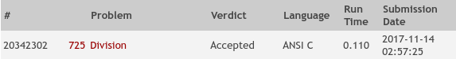
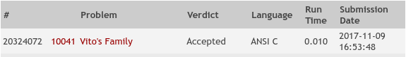
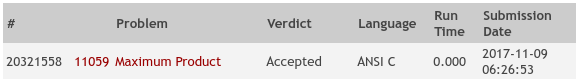
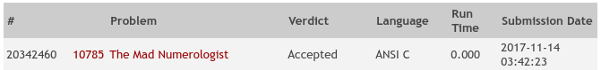

# Problemas

## Iterativos
* 102
* 188
* 253
* 471
* 927
* 10177
* 10976

### Aceptados
* 725

* 10041

* 11059

## Divide y Conquista
* 679
* 957
* 10032
* 10341
* 10474
* 10706
* 11621
* 11701
* 11876
* 12190

### Aceptados

## Algoritmos Ávidos
* 10020
* 10152
* 10340
* 10656
* 10763
* 11103
* 11264
* 11900
* 12210

### Aceptados
* 10785

 
## Programación Dinámica
* 108
* 111
* 481
* 507
* 787
* 10313
* 10664
* 10667
* 11003
* 11137

### Aceptados
